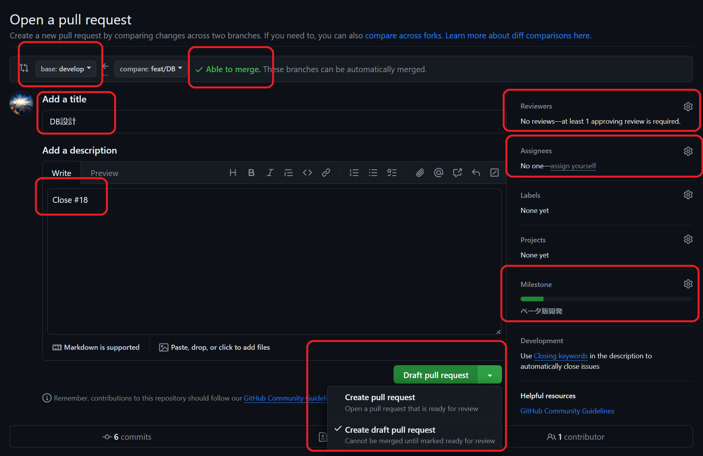

# 02.DevProcess
# 開発手順書

## 新たな開発を始めるとき

新たにタスクが割り振られ、開発を始めるときの手順書です。既に開発を進めているタスクがある場合は、[日々の開発手順](##日々の開発手順)へ進んでください。

### 1. タスクの割り振り

基本的にタスク管理は[github issues](https://github.com/TUS-OSK/quantum-gomoku/issues)で行います。気になったタスクがあれば@oginoshikibu に聞いてください。特になければ相談の上割り振ります。

### 2. localでの作業

基本的にVSCode上で全ての作業を行うと、楽なことが多いです。

1. VSCodeを起動し、フォルダが開かれていない場合は最上部のファイル>最近使用した項目>wikipedia-golfを選択
2. 下部にターミナルが開かれていない場合は`Ctrl + j`や、最上部のターミナル>新しいターミナルより開く
3. ターミナル上で`git branch`を実行し、現在のブランチが`develop`であることを確認する
   1. 異なる場合は`git switch develop`で移動
4. `git pull origin develop`を実行し、最新にする
5. `git switch -c <ブランチ名>`割り振られたタスクに適したブランチ名でブランチを作成し、移動
6. リモートにブランチを生やすため、ファイル作成や一文字追加など微小な変更をして`push`
   - `push`しない方法も勿論あるのですが、ちょっと特殊なのでこちらの方が簡単に済むと思います。

#### ブランチ名について

ブランチ名は **「見ただけで何をやっているかわかる」** が理想です。

ルールとしては、`<開発種別>/<具体的な内容>`としてください。

開発種別（prefix）は

- feat: 新規機能の開発（featureの略）
- debag: デバッグ
- refact: リファクタリング
- fix: typoや軽微な修正
- test: テストの追加・変更
- docs: ドキュメントの作成・変更
- move: ファイルの移動や削除
- build: ツールによるビルド

辺りを予定しています。基本的にissueのprefixに合わせる方針でよいです。もし上記に当てはまらないものがあれば@oginoshikibu まで相談ください。

具体的な内容の命名規則は、英語を使う以外には特に定めません。

命名例
- feat/front-login-button: フロントエンドのログインボタンの追加
- fix/cicd: CI/CDの編集
- move/renum-docs: ドキュメントの再度ナンバリング

### 3. ブラウザ上での作業

[Git Hub](https://github.com/TUS-OSK/quantum-gomoku)を開いて`PR`(`Pull Request`)を出します。

1. [Git Hub](https://github.com/TUS-OSK/quantum-gomoku)を開くと、上部に先ほど`push`したブランチ名が記載された以下のようなボタンが現れるのでクリック
2. 以下各項目の設定をする
   - `merge`先が`develop`ブランチで、`merge`可能の表記が出ているか確認
   - `title`欄を適切なものに変更
   - `Description`欄に`Close #<issue番号>`を記載する。`#`を入力すると、サジェストが効きくので、`front`や`docs`など担当の`issue`名に含まれる単語を打つのが早いと思います。
   - `Reviewers`に@oginoshikibu を追加
   - `Assignees`に自身を追加
   - `Milestone`に`ベータ版開発`を追加
3. 緑色ボタン`Create Pull Request`の右にある三角を押し、`Draft`を選択

## 日々の開発手順

多くの場合はVSCodeで事足りると思います。
また新規機能を追加した場合は、`/docs/`内の仕様書の変更も忘れずにお願いします。

### `git`操作

怒られた場合はちゃんとエラー文を読みましょう。ただなるべく事故らないような指示を出しているので、問題はそんなに起きないと思っています。

-  `git add <file>`: `<file>`をステージングする。`.`など、ディレクトリ毎指定することも可能。
-  `git commit -m <commit message>`: ステージングされたファイルを`commit`する。`<commit message>`は適当でよいので、**出来るだけ`commit`の頻度を高くしてください。**
- `git push origin <現在のブランチ名>`: `push`する。ちゃんとブランチを切っていれば、基本的にコンフリクトは起きないと思います。また誰かに相談するときは、最新のものを`push`してからだとスムーズです。
- `git pull origin <現在のブランチ名>`: リモートから取り込む。コンフリクトしがちな`pull`ですが、今回の開発では人数が少ないのでちゃんと現在のブランチを指定すれば、事故ることはないと思います。
- `git branch`: ブランチ一覧と現在のブランチがわかります。オプション`-a`をつけると、リモートのブランチも表示されます。
- `git switch <ブランチ名>`: ブランチ移動のコマンドです。コミットしていないファイルがある状態で移動すると、削除されてしまうので注意。オプション`-c`をつけると、ブランチ作成&移動することが出来ます。

### ローカル実行

wip

## 開発が完了した場合

### 1. Draftを外してreview依頼

[PR](https://github.com/TUS-OSK/quantum-gomoku/pulls)より自分の`PR`を選択し、グレーの`Ready for review`ボタンを押す。discordの`#dev-連絡`でreviewerにメンションつけてもらえると助かります。

### 2. review内容を確認・修正

reviewが帰ってきたら、その指摘事項をlocalにて修正します。reviewerから変更例が出ている場合、PR画面上でも`commit`することが出来ます。適宜疑問点があれば、replyにて返信しましょう。

### 3. Close

Approvalが出るまで1, 2を繰り返します。 出た場合は`Merge pull request`のボタンより`develop`へ`merge`し、ブランチを削除（github上ではボタン、ローカルでは`pull`してから`git branch -d <ブランチ名>`）て終了です。お疲れさまでした。

## Issueの立て方

wip

prefix: `feat`, `fix`, `docs`, `test`, `move`, `build`, `refact`, `debag`
